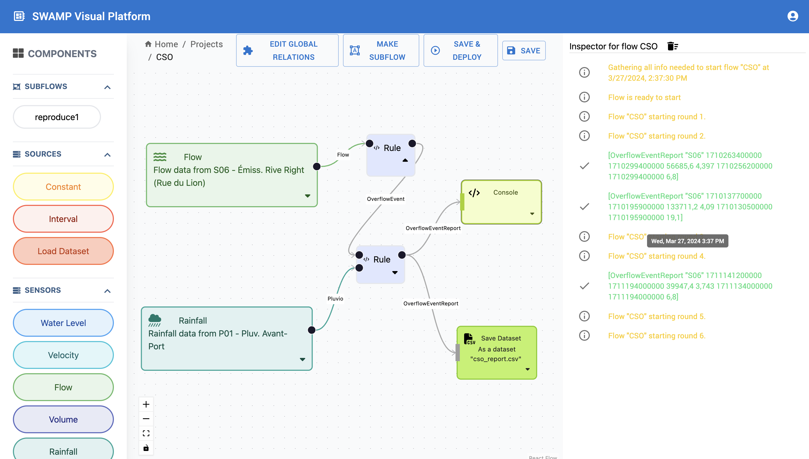
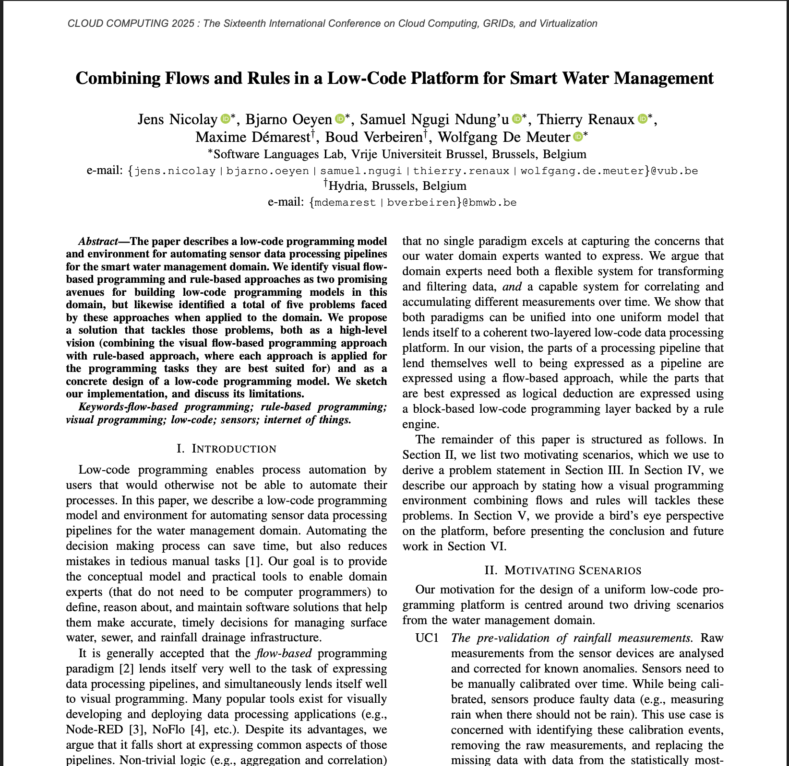

# [SWAMP (closed source)](https://researchportal.vub.be/en/projects/joint-rd-2020-swamp-a-smart-water-management-platform-for-the-bru/)
The overall goal of [this project](https://researchportal.vub.be/en/projects/joint-rd-2020-swamp-a-smart-water-management-platform-for-the-bru/) is to explore the design of composable abstractions that enable the combination of flow-based and rule-based programming in the context of event-driven IoT applications, and a visual environment for manipulating these abstractions by non-technical users.

